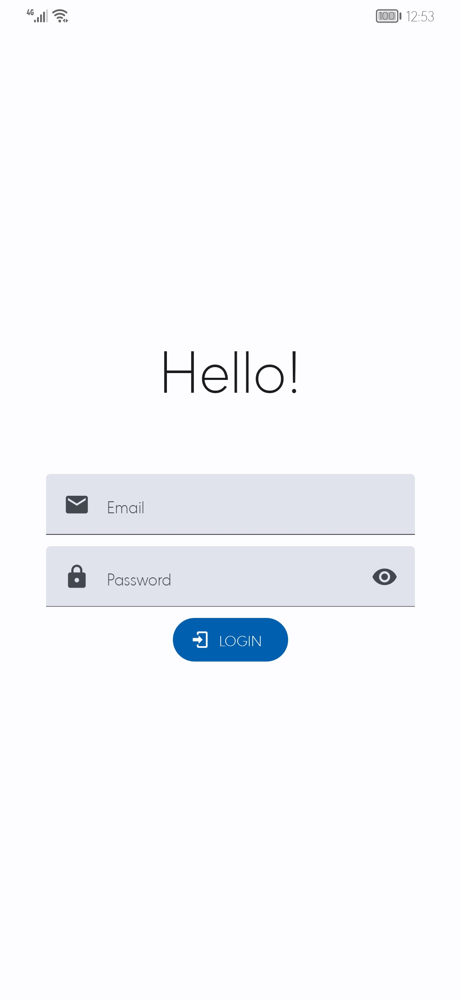
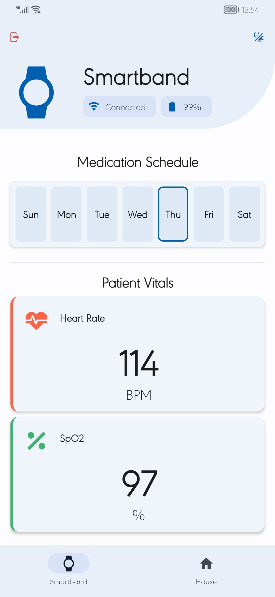
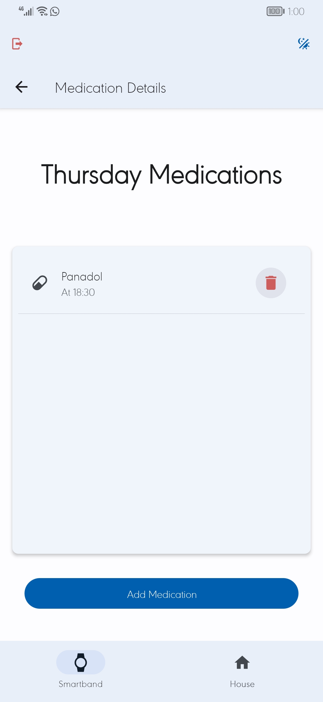
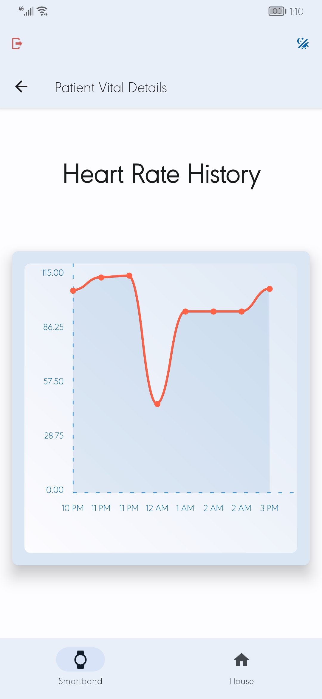
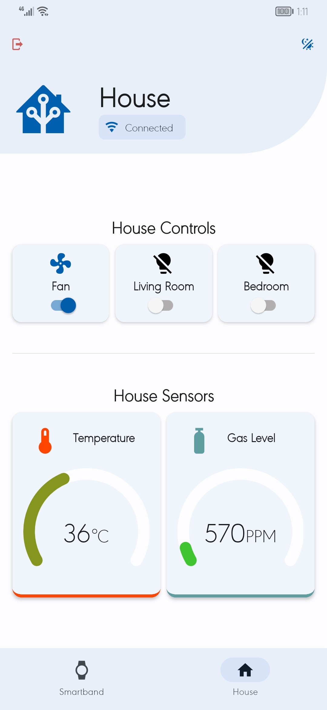
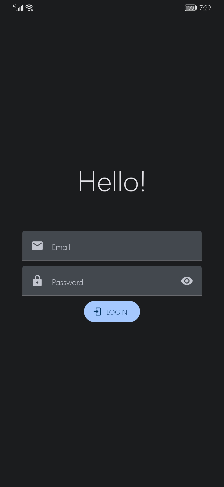

# Remote Patient Monitoring System

> Readme and the project are still a work in progress.

This is a companion app for the RPM System which me and my team are building for our Graduation Project, 2023.
It's an app for doctors or care providers to monitor their patients' health, state, and remind them of their medication. As well as to monitor their house for extra safety.

## Tech Used

- React Native (Expo)
  - SWR
  - React Native Paper
  - React Navigation
  - Notifee
- PocketBase
- Arduino Cloud

## Screenshots

1. Login Screen
   
    

2. Smart Band Screen
   
    

3. Medication Schedule Screen
   
    

4. Vital History Screen
   
    

5. House Monitoring Screen
   
    

There's also a **Dark Mode**!
    
  
